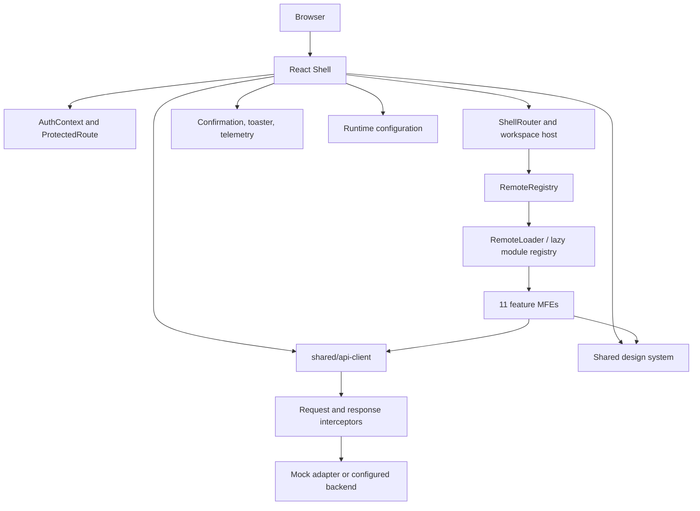
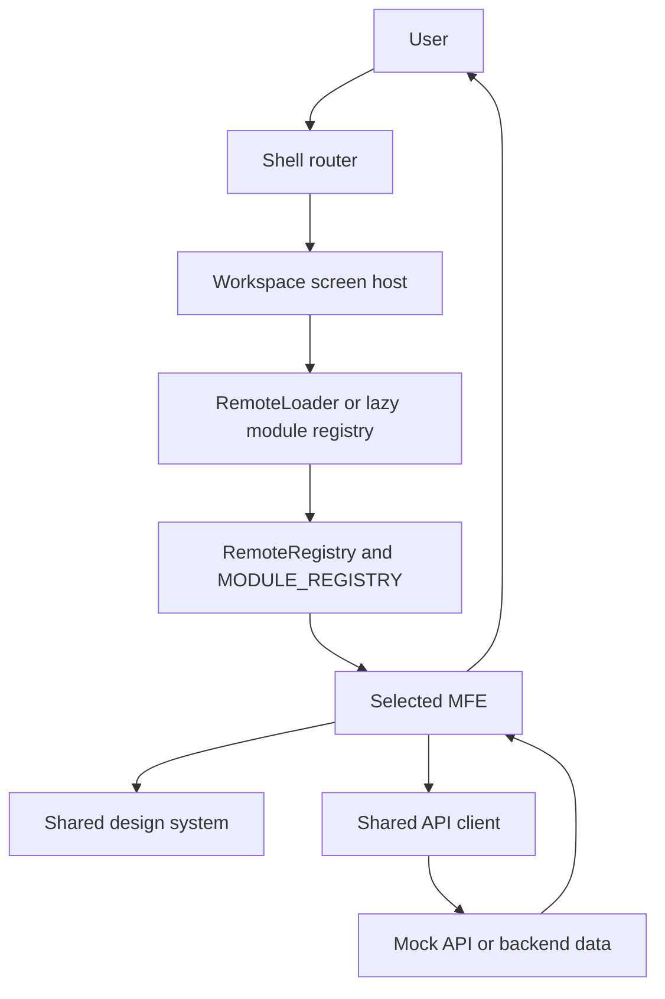
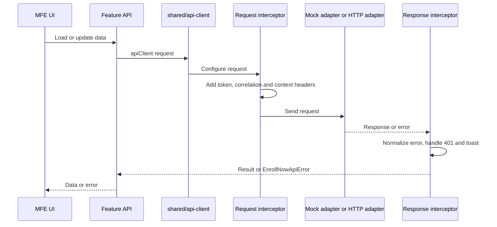
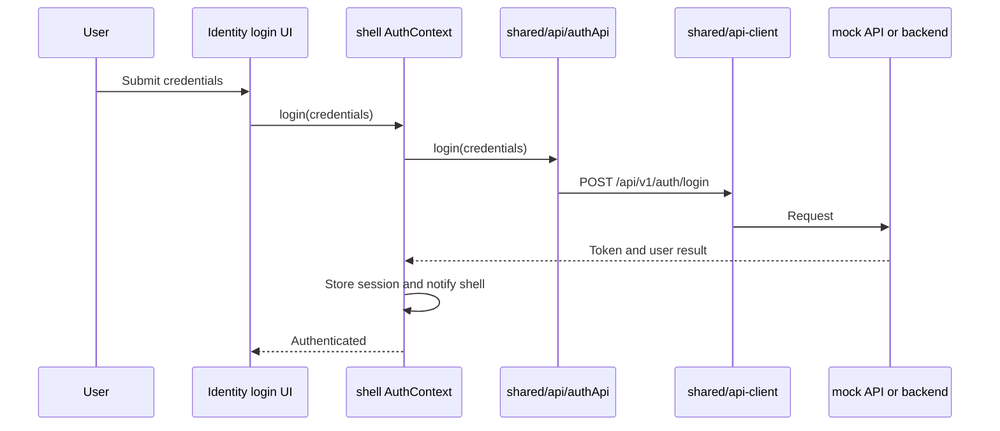
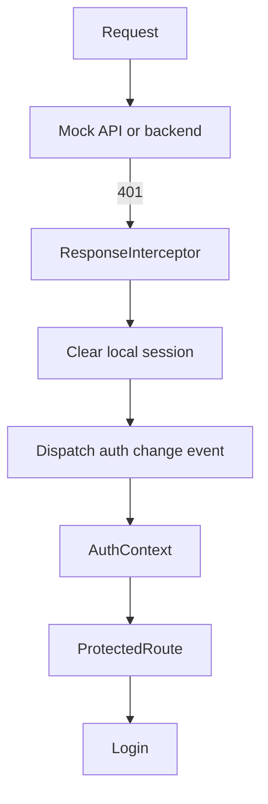
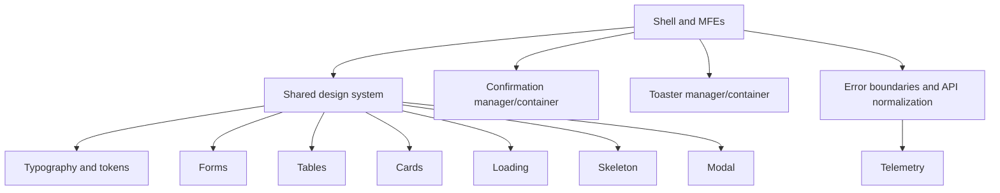

# EnrollNow Frontend Architecture

## Repository map

The frontend is an npm-workspaces monorepo. `shell/` owns the browser application, `microfrontends/` contains the eleven feature remotes, `shared/` provides cross-application contracts and services, and `packages/administrator-ui/` is a separately distributed administrator UI package. `scripts/` contains vendor bundling support.

## Runtime architecture

## Applications and remotes

| MFE | Responsibility | Entry point | API layer | Loaded by |
|---|---|---|---|---|
| Identity | Login and identity | `microfrontends/identity/src/remoteEntry.tsx` | `shared/api/authApi.ts` | Shell `/login` |
| Administration | User administration and RBAC | `microfrontends/administration/src/remoteEntry.tsx` | `microfrontends/administration/src/api/administratorApi.ts`, `shared/api/administrationApi.ts` | Shell `/admin` |
| Organization | Organizations and sites | `microfrontends/organization/src/remoteEntry.tsx` | `shared/api/organizationApi.ts` | Shell |
| Study | Study protocols | `microfrontends/study/src/remoteEntry.tsx` | `shared/api/studyApi.ts` | Shell |
| Participant | Participant registry | `microfrontends/participant/src/remoteEntry.tsx` | `shared/api/participantApi.ts` | Shell |
| Recruitment | Recruitment campaigns | `microfrontends/recruitment/src/remoteEntry.tsx` | `shared/api/recruitmentApi.ts` | Shell |
| Survey | Survey authoring and results | `microfrontends/survey/src/remoteEntry.tsx` | `microfrontends/survey/src/api/surveyApi.ts`, `shared/api/surveyApi.ts` | Shell |
| Task | Tasks and operations | `microfrontends/task/src/remoteEntry.tsx` | `shared/api/taskApi.ts` | Shell |
| Communication | Outreach and communications | `microfrontends/communication/src/remoteEntry.tsx` | `shared/api/communicationApi.ts` | Shell |
| Document | Document repository | `microfrontends/document/src/remoteEntry.tsx` | `shared/api/documentApi.ts` | Shell |
| Dashboard | Clinical operations dashboard | `microfrontends/dashboard/src/remoteEntry.tsx` | `shared/api/dashboardApi.ts` | Shell |

Each MFE has a `src/index.ts` and `src/main.tsx` standalone entry as well as a `src/remoteEntry.tsx` entry consumed by the shell. `shell/src/modules/index.tsx` lazy-loads the local remotes and wraps them with shared loading and error boundaries. `shell/src/remotes/RemoteRegistry.ts` supplies remote metadata/configuration; `RemoteLoader.tsx` handles loading.

## Routing and navigation

`shell/src/App.tsx` composes the shell. `shell/src/routing/ShellRouter.tsx` declares public login, protected feature routes, unauthorized handling, and fallback redirects. `ProtectedRoute.tsx` gates authenticated routes. `WorkspaceScreenHost.tsx` hosts the active screens and keeps opened panes mounted. Navigation state and tab state live under `shell/src/navigation/` (`NavigationContext.tsx`, `TabWorkspaceContext.tsx`, `TopNavigation.tsx`, and `UserMenu.tsx`).

## API request flow

Feature APIs use `shared/api-client/index.ts`; `shared/api-config.ts` resolves the API mode/base URL and `shared/runtime-config/index.ts` loads runtime settings. The client selects the mock adapter in mock mode and the Axios HTTP adapter otherwise. The request interceptor adds `Authorization`, correlation, tenant, and organization headers. The response interceptor normalizes errors, records telemetry, handles expired sessions, and reports errors through the shared toaster.

## Authentication

The session is persisted in `localStorage` as `enrollnow_token` and `enrollnow_user`; `shell/src/auth/AuthContext.tsx` restores and validates it through `authApi`. The API client reads the active header provider first and falls back to the token in storage. Its request interceptor adds the bearer header. A non-login 401 clears stored session and broadcasts the auth-change event. Logout clears session, calls the logout API, and navigates to `/login`. `shell/src/routing/ProtectedRoute.tsx` enforces access.

## Session expiration flow

## Styling and shared UI

Application UI uses React `className` values and SCSS. The authoritative shared entry is `shared/design-system/styles/index.scss`; reusable components are exported through `shared/design-system/components/index.ts`. The package provides tokens, resets, layout, forms, tables, cards, modals, loading, skeleton, empty states, survey styles, toaster, and confirmation styles. Feature-specific styles remain beside their MFE (for example `microfrontends/survey/src/styles/survey.scss`).

Shared infrastructure includes `shared/confirmation/`, `shared/toaster/`, `shared/telemetry/`, `shared/contracts/`, and `shared/mock-api/`. The mock API supports local frontend work while the backend is unavailable. `packages/administrator-ui/dist/` contains the package's prebuilt distribution and is referenced as a file dependency by the shell; retain it as a distribution artifact.

## Global UI and error handling

`ErrorBoundary` isolates remote rendering failures. API failures pass through the centralized response interceptor. Confirmation and toaster state are managed by their shared managers and rendered by shared containers.

## Build and configuration

The root `package.json` defines npm workspaces and delegates build, test, and typecheck tasks. The shell is built with Vite (`shell/vite.config.ts`). Each MFE also has its own Vite configuration and HTML entry for standalone development. `shell/public/runtime-config.json` and `shared/runtime-config/index.ts` provide runtime configuration; `VITE_API_BASE_URL` and API mode settings control backend selection. Public assets under `shell/public/` include favicon variants and login imagery referenced by public URL.
